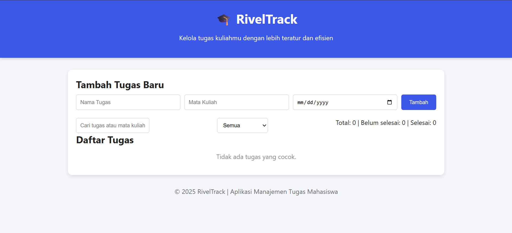
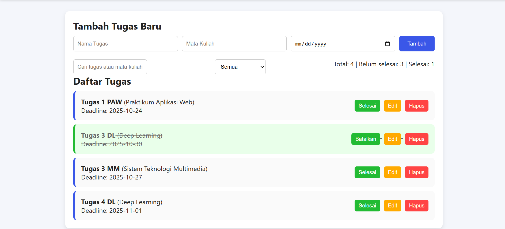
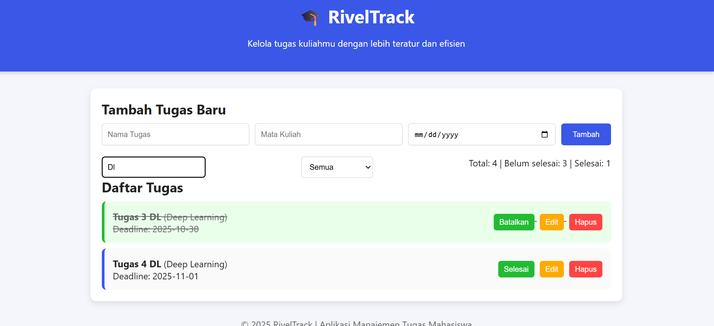

<<<<<<< HEAD
# Aplikasi Manajemen Tugas Mahasiswa

RivelTrack adalah aplikasi berbasis web yang membantu mahasiswa dalam mengelola aktivitas akademik mereka, seperti tugas dan proyek kuliah.
Aplikasi ini bersifat interaktif, fungsional, dan menyimpan data secara lokal menggunakan localStorage, sehingga data tidak akan hilang meskipun halaman direfresh.

Aplikasi dibuat dengan HTML, CSS, dan JavaScript murni (tanpa framework) dengan antarmuka modern dan responsif.

## ✨ Fitur Utama
- ➕ Tambah Tugas
- ✏️ Edit Tugas
- ✅ Tandai Selesai / Belum
- 🗑️ Hapus Tugas
- 🔍 Pencarian & Filter
- 📊 Statistik Ringkas
- 🧠 Validasi Form
- 💾 Penyimpanan Lokal

## 🖼️ Screenshot Aplikasi

- Tampilan Awal Aplikasi RivelTrack:

- Menambahkan dan Menandai Tugas Selesai atau Belum

- Fitur Filter & Pencarian

=======
# Aplikasi Personal Dashboard Sederhana

Aplikasi personal dashboard berbasis web yang dibuat menggunakan HTML, CSS, dan JavaScript (ES6+). Aplikasi ini dapat memungkinkan pengguna untuk menambahkan, mengedit atau menghapus informasi pada jadwal kuliah, daftar tugas dan catatan serta aplikasi ini dibuat dengan antarmuka yang minimalis.

## ✨ Fitur Utama

- ✅ Tambah tugas baru ke daftar
- 🗑️ Hapus tugas dari daftar
- 💾 Penyimpanan data secara lokal (Local Storage)
- 📱 Tampilan yang responsif dan ringan

## 💻 Screenshot Aplikasi

Berikut adalah tampilan dari aplikasi personal dashboard mode terang:

.

Berikut adalah tampilan dari aplikasi personal dashboard mode gelap:

>>>>>>> 7a3d01a7eda446b0c8e991f535881b8ea83b38de

## 🧠 Fitur ES6+ yang Diimplementasikan

Aplikasi ini dibangun menggunakan fitur-fitur modern JavaScript (ES6+), antara lain:

<<<<<<< HEAD
- ✅ **Tambah tugas baru (nama tugas, mata kuliah, deadline)**  `
- ✅ **Edit tugas yang sudah ada**  
- ✅ **Let dan Const** 
- ✅ **Tandai tugas selesai / belum selesai**
- ✅ **Hapus tugas dengan konfirmasi**
- ✅ **Filter berdasarkan status tugas**
- ✅ **Pencarian berdasarkan teks atau nama mata kuliah**
- ✅ **Statistik jumlah tugas selesai dan belum selesai**
- ✅ **Validasi input form**
- ✅ **Penyimpanan lokal menggunakan localStorage**
- ✅ **Antarmuka modern, responsif, dan mudah digunakan**
=======
- ✅ **Arrow Functions**  
  Contoh: `const tambahTodo = () => { ... }`

- ✅ **Template Literals**  
  Contoh: `` `<li>${todo.text}</li>` ``

- ✅ **Let dan Const**  
  Untuk mendeklarasikan variabel yang bersifat block-scoped

- ✅ **Array Methods (map, filter, forEach)**  
  Digunakan untuk memanipulasi dan merender daftar tugas

- ✅ **Destructuring Assignment**  
  Contoh: `const { text, completed } = todo;`

- ✅ **Event Listeners dengan callback ES6**  
  Contoh: `button.addEventListener('click', () => {...});`

- ✅ **Fungsi Asinkron, Async Await**
>>>>>>> 7a3d01a7eda446b0c8e991f535881b8ea83b38de

## 🏁 Cara Menjalankan

1. Clone repository ini
2. Buka file `index.html` di browser
3. Selesai!

---

<<<<<<< HEAD
> Dibuat oleh Muhammad Riveldo Hermawan Putra
=======
> Dibuat oleh Muhammad Riveldo Hermawan Putra

>>>>>>> 7a3d01a7eda446b0c8e991f535881b8ea83b38de
