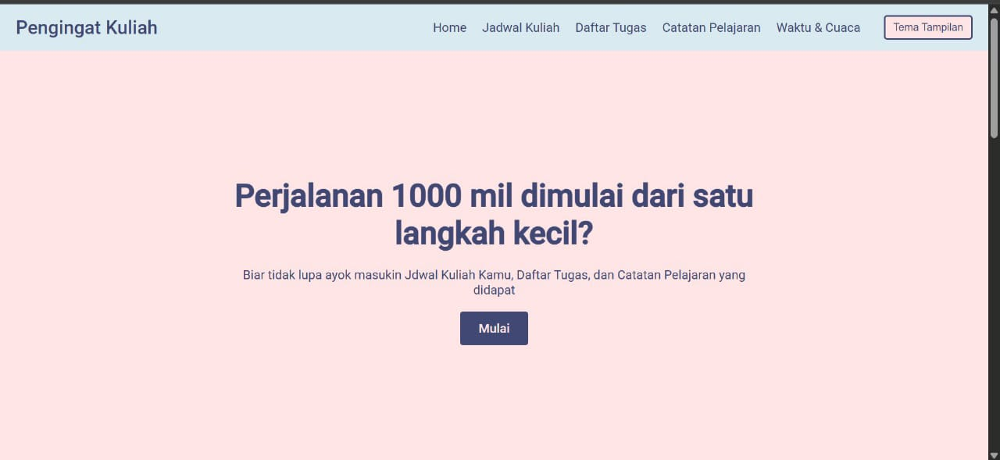
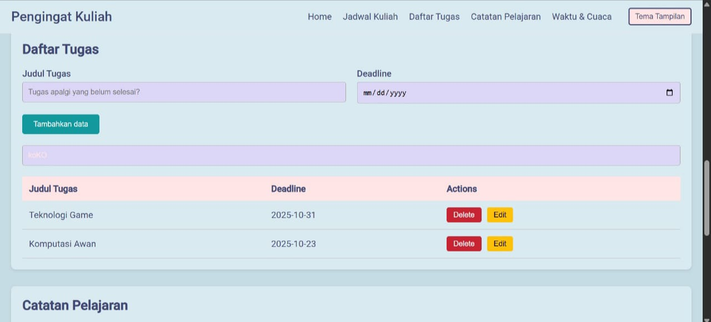
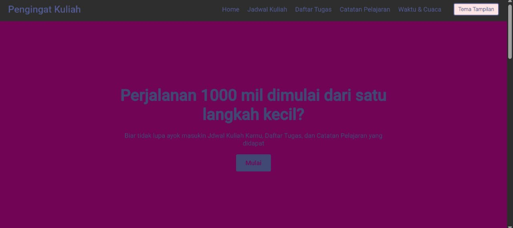
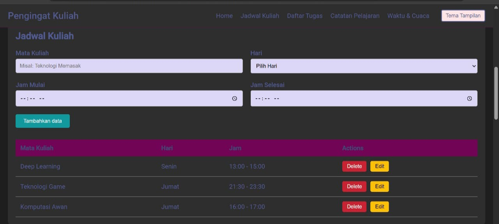

# Aplikasi Personal Dashboard Sederhana

Aplikasi personal dashboard berbasis web yang dibuat menggunakan HTML, CSS, dan JavaScript (ES6+). Aplikasi ini dapat memungkinkan pengguna untuk menambahkan, mengedit atau menghapus informasi pada jadwal kuliah, daftar tugas dan catatan serta aplikasi ini dibuat dengan antarmuka yang minimalis.

## ✨ Fitur Utama

- ✅ Tambah tugas baru ke daftar
- 🗑️ Hapus tugas dari daftar
- 💾 Penyimpanan data secara lokal (Local Storage)
- 📱 Tampilan yang responsif dan ringan

## 💻 Screenshot Aplikasi

Berikut adalah tampilan dari aplikasi personal dashboard mode terang:

.

Berikut adalah tampilan dari aplikasi personal dashboard mode gelap:

## 🧠 Fitur ES6+ yang Diimplementasikan

Aplikasi ini dibangun menggunakan fitur-fitur modern JavaScript (ES6+), antara lain:

- ✅ **Arrow Functions**  
  Contoh: `const tambahTodo = () => { ... }`

- ✅ **Template Literals**  
  Contoh: `` `<li>${todo.text}</li>` ``

- ✅ **Let dan Const**  
  Untuk mendeklarasikan variabel yang bersifat block-scoped

- ✅ **Array Methods (map, filter, forEach)**  
  Digunakan untuk memanipulasi dan merender daftar tugas

- ✅ **Destructuring Assignment**  
  Contoh: `const { text, completed } = todo;`

- ✅ **Event Listeners dengan callback ES6**  
  Contoh: `button.addEventListener('click', () => {...});`

- ✅ **Fungsi Asinkron, Async Await**

## 🏁 Cara Menjalankan

1. Clone repository ini
2. Buka file `index.html` di browser
3. Selesai!

---

> Dibuat oleh Muhammad Riveldo Hermawan Putra

