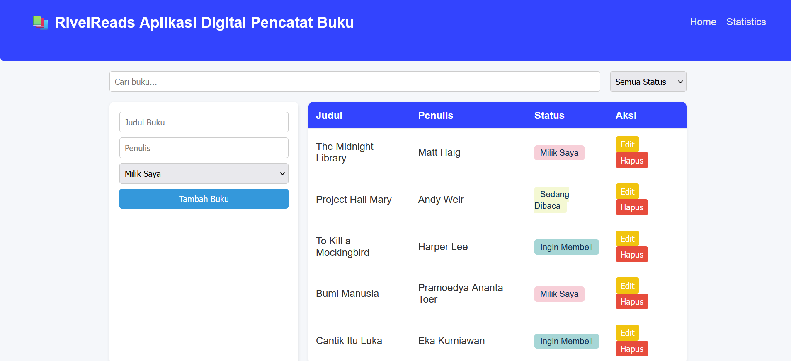
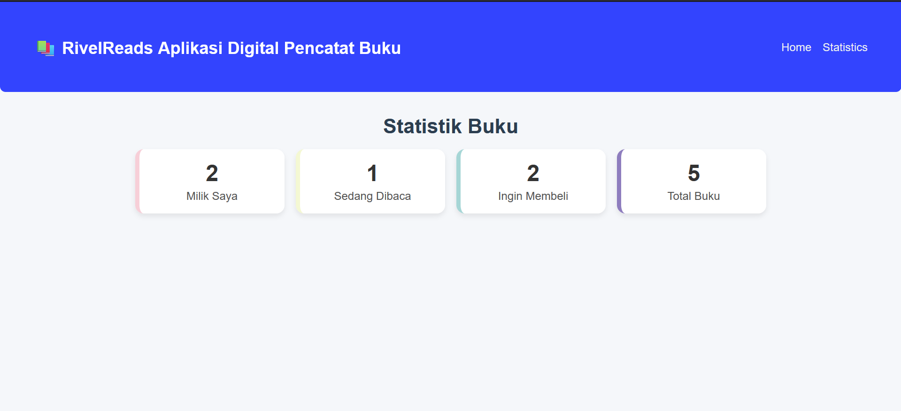
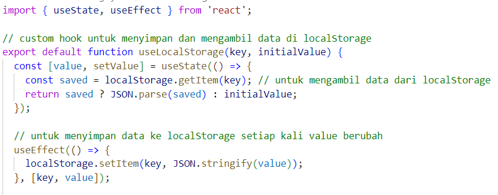
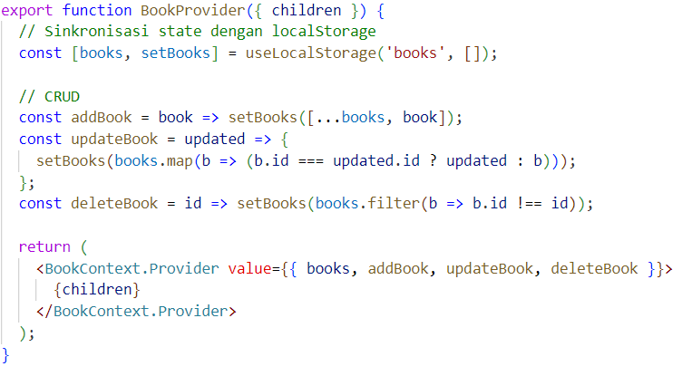
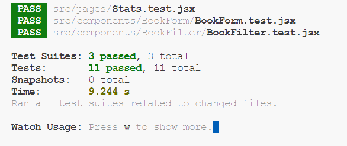

# 📚 RivelReads

Aplikasi manajemen koleksi buku pribadi bernama RivelReads, dibuat menggunakan React JS. Aplikasi ini memungkinkan pengguna untuk menambahkan buku yang sudah dimiliki, sedang dibaca dan ingin dibeli serta dapat mencari buku yang telah disimpan sebelumnya di `localStorage`. Terdapat juga fitur untuk mengedit dan menghapus buku yang ada. Selain itu, ada halaman statistic yang dapat melihat jumlah keseluruhan buku yang telah kita masukkan untuk di simpan di `localStorage`.

---

## 🔍 Deskripsi Aplikasi

RivelReads menyediakan fitur untuk:
- **Menambah buku baru** dengan data judul, penulis, status: Milik Saya / Sedang Dibaca / Ingin Membeli)  
- **Mengedit** dan **Menghapus** entri buku  
- **Filter** daftar buku berdasarkan status  
- **Pencarian** buku berdasarkan judul  
- **Notifikasi** menggunakan React Toastify untuk aksi berhasil/gagal  

---

## ⚙️ Instruksi Instalasi dan Menjalankan

1. **Clone repository**  
   ```bash
   git clone https://github.com/MuhammadRiveldo/pemrograman_web_itera_122140037.git
   cd MuhammadRiveldo pemrograman_web_itera_122140037

2. **Install dependencies**  
   ```bash
   npm install

3. **Menjalankan aplikasi react**  
   ```bash
   npm start

4. **Jalankan unit testing**  
   ```bash
   npm test

---

## 📸 Screenshot Antarmuka

Berikut ini adalah tampilan dari website RivelReads halaman Home:
 
.

Berikut ini adalah tampilan dari website RivelReads halaman Statistics:


---

## 🚀 Fitur React yang Digunakan
Website ini dibangun menggunakan fitur-fitur React sebagai berikut:

- ✅ **Create React App (CRA)**  
  sebagai boilerplate

- ✅ **Functional Components, Hooks**  
  contoh: `useState, useEffect`

- ✅ **Custom Hooks**  
  `useLocalStorage` untuk sinkronasi state ↔️ localStorageh
  
  `useBookStats` untuk menghitung total buku yang ada

- ✅ **Context API**  
  `BookContext` untuk state global dan CRUD

- ✅ **PropTypes**  
  untuk validasi props

- ✅ **React Router**  
  `react-router-dom` untuk navigasi Home dan Stats

- ✅ **React Toastify**  
  untuk menampilkan notifikasi berhasil atau gagal

---

## 📝 Komentar dalam Kode

- Pada folder `src/hooks/useLocalStorage.js`

.
- Pada folder `src/context/BookContext.jsx`


---

## ✅ Laporan Testing
Berikut ini hasil dari unit testing yang dilakukan:




---
> Dibuat oleh Muhammad Riveldo Hermawan Putra
