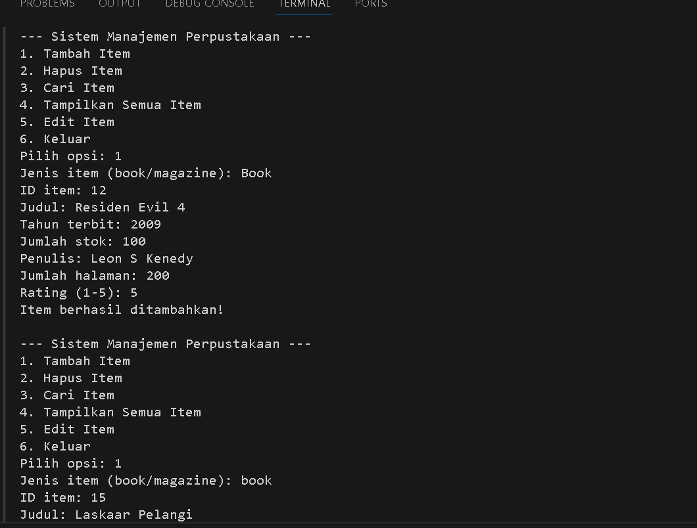
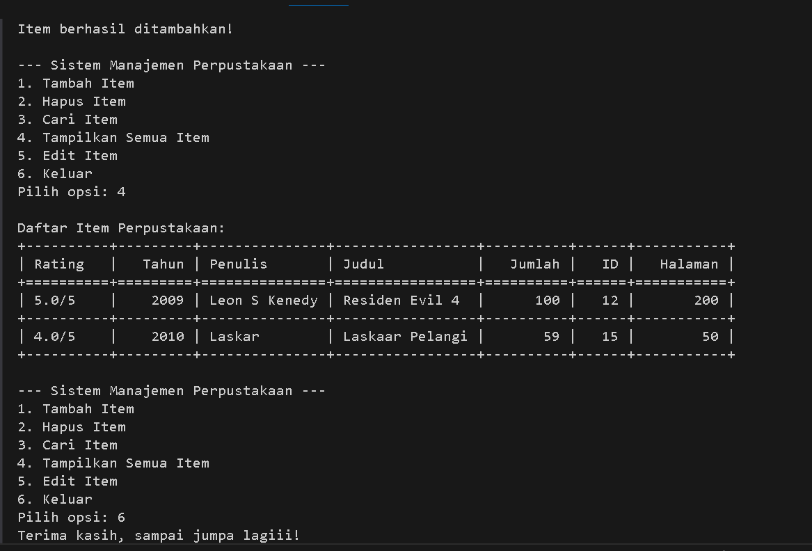

# 🧮 Manajemen Perpustakaan Sederhana (OOP Python)
**Nama:** Muhammad Riveldo Hermawan Putra \
**NIM:** 122140037

---

## 📖 Deskripsi Program

Program ini adalah sistem manajemen perpustakaan berbasis terminal yang dibuat menggunakan konsep Object-Oriented Programming (OOP) pada Python.
Tujuan dari sistem ini adalah untuk mengelola koleksi item perpustakaan seperti buku dan majalah dengan operasi dasar CRUD (Create, Read, Update, Delete).

Program ini mengimplementasikan 4 pilar utama OOP:
1. Abstraction — Menggunakan class abstrak LibraryItem.
2. Inheritance — Subclass Book dan Magazine mewarisi dari LibraryItem.
3. Encapsulation — Menggunakan atribut protected (_attribute) dan private (__attribute).
4. Polymorphism — display_info() diimplementasikan berbeda pada tiap subclass.

---
## ⚙️ Fitur Utama Program

| Fitur                       | Deskripsi                                                         |
| --------------------------- | ----------------------------------------------------------------- |
| ➕ **Tambah Item**           | Menambahkan buku atau majalah baru ke dalam koleksi perpustakaan. |
| 🗑️ **Hapus Item**          | Menghapus item berdasarkan ID.                                    |
| 🔍 **Cari Item**            | Mencari item berdasarkan **judul** atau **ID**.                   |
| 📋 **Tampilkan Semua Item** | Menampilkan semua koleksi perpustakaan dalam format tabel.        |
| ✏️ **Edit Item**            | Mengubah informasi item seperti judul, tahun, stok, penulis, dll. |
| 💾 **Validasi Data**        | Memastikan rating berada dalam rentang 1–5.                       |
| 🧱 **Encapsulation**        | Data internal disembunyikan melalui atribut protected/private.    |

---

## 🏗️ Penjelasan Singkat Tiap Kelas 

### 1️⃣ LibraryItem (Abstract Class)
- Menjadi dasar untuk semua jenis item perpustakaan.
- Memiliki atribut umum seperti: item_id, title, year, dan quantity.
- Memiliki metode abstrak display_info() yang wajib diimplementasikan subclass.

### 2️⃣ Book (Subclass)
- Mewarisi dari LibraryItem.
- Memiliki atribut tambahan: author, pages, dan rating.
- rating menggunakan property decorator untuk validasi (1–5).
- Override display_info() dengan informasi buku.

### 3️⃣ Magazine (Subclass)
- Mewarisi dari LibraryItem.
- Atribut tambahan: issue dan publisher.
- Override display_info() menampilkan informasi majalah.

### 4️⃣ Library
- Mengelola semua koleksi item dengan list private (__items).
- Memiliki fitur CRUD:
- add_item() → Tambah item baru.
- remove_item() → Hapus item berdasarkan ID.
- search_by_id() dan search_by_title() → Cari item.
- display_all_items() → Tampilkan koleksi dalam tabel menggunakan tabulate.

---

## 🖼️ Screenshot Hasil Running Program

 \

---

## 📚 Kesimpulan

Program ini berhasil mengimplementasikan seluruh konsep utama OOP:
- Abstraction (melalui abstract class LibraryItem)
- Inheritance (subclass Book dan Magazine)
- Encapsulation (protected/private attributes)
- Polymorphism (display_info() yang berbeda di setiap subclass)
- Selain itu, fitur CRUD berfungsi dengan baik, dan tampilan tabel memperjelas hasil output di terminal.

---
> Dibuat oleh Muhammad Riveldo Hermawan Putra